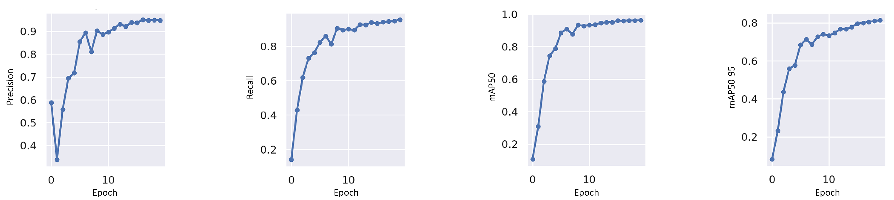
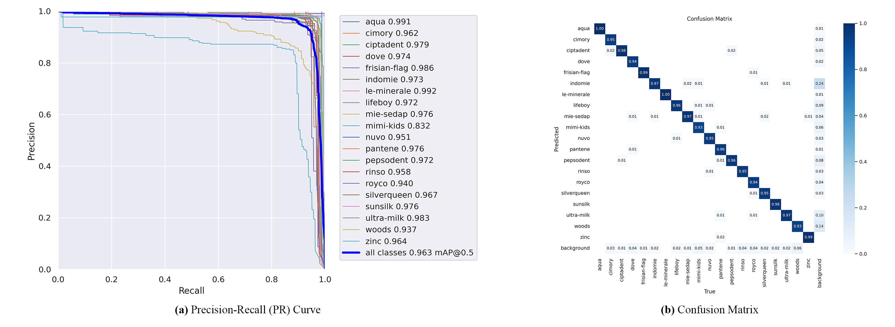

# YOLOv8 for Product Brand Recognition as Inter-Class Similarities

Fine-grained grocery products refer to items that are similar in appearance and require a high level of detail to distinguish from one another. In the context of smart retail, fine-grained grocery products can pose a challenge for computer vision systems that are designed to recognize and classify objects. This is because the differences between similar products may be subtle and difficult to detect, even for humans. 

For example, consider a dataset of different types of apples. While it may be easy for a human to distinguish between a Granny Smith apple and a Red Delicious apple, a computer vision system may struggle to identify the subtle differences in color, shape, and texture that distinguish these two types of apples. This is especially true if the apples are photographed under different lighting conditions or from different angles. 

To address this challenge, researchers have developed specialized computer vision models that are designed to recognize fine-grained categories of objects. These models typically use advanced techniques such as deep learning and convolutional neural networks to analyze images and identify subtle differences between similar objects. In the context of smart retail, these models can be used to improve the accuracy of product recognition and enable more efficient and automated checkout processes.

  
[YOLOv8](https://github.com/ultralytics/ultralytics) is a computer vision model that has been used to recognize and classify grocery products. In the context of smart retail, YOLOv8 can be used to automate the checkout process by identifying and tracking products as they are scanned. 

To use YOLOv8 for grocery product recognition, a dataset of common grocery products is first developed. This dataset includes images of products from different angles and under different lighting conditions to simulate real-world scenarios. The dataset is then split into training, validation, and testing sets, and the YOLOv8 model is trained on the training set using deep learning techniques. 

Once the model is trained, it can be used to recognize and classify grocery products in real-time. When a product is scanned, the YOLOv8 model analyzes the image and identifies the product based on its features and characteristics. The model can also track the product as it moves through the checkout process, ensuring that the correct product is associated with the correct transaction. 

Overall, YOLOv8 has shown promising results for grocery product recognition, achieving a mean average precision (mAP) of 0.96303 in one experiment. This suggests that the model has the potential to improve the efficiency and accuracy of the checkout process in smart retail.

 

